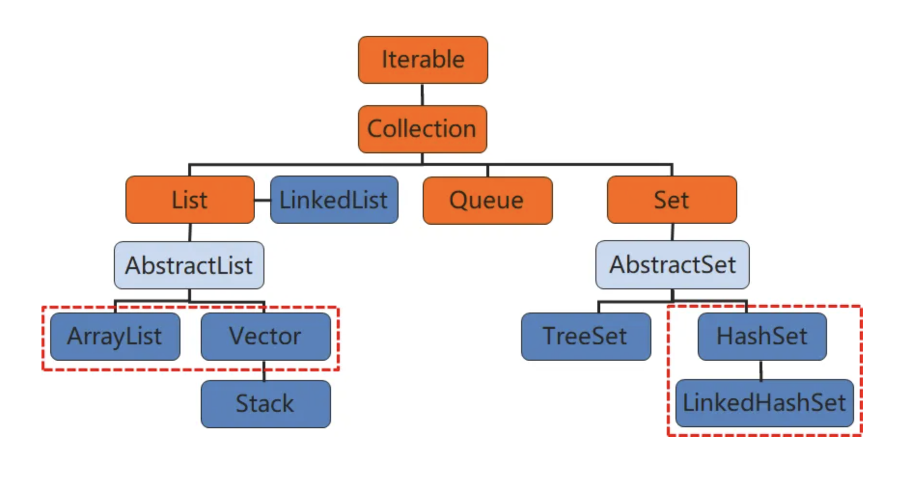

# Collection

## Collection 特点
- Collection 是一个接口，表示一组对象。
- Collection 有两个子接口，分别是 List 和 Set。
- 所有 List 和 Set 的实现类都实现了 Collection 的方法。


## Collection 接口定义的方法

- 查看属性：容器中`元素不发生变化`

```java
// 是否包含元素
boolean contains(Object element);
// 是否包含 容器(内的所有元素)
boolean containsAll(Collection c);
// 元素数量
int size();
// 是否为空
boolean isEmpty();
// 获取迭代器，用于遍历
Iterator iterator();
// 转化成Object数组
Object[] toArray();
```

- 操作方法：容器中`元素发生变化`

```java
// 增加元素到容器中
boolean add(Object element);
// 增加(容器中所有)元素
boolean addAll(Collection c);
// 移除元素
boolean remove(Object element);
// 移除(容器中交集的)元素
boolean removeAll(Collection c);
// 取(容器中交集的)元素
boolean retainAll(Collection c);
// 清空元素
void clear();
```